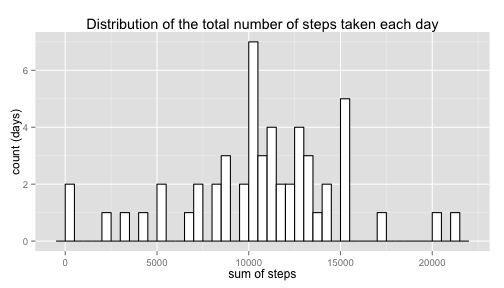
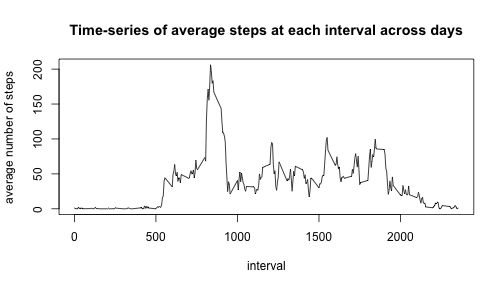

# Reproducible Research: Peer Assessment 1
This is an R-markdown for Peer Assessment 1 in Reproducible Research.  
Written by ai  
knit2html('PA1_template.Rmd')


## Loading and preprocessing the data
Go to the right directory, and read in data

```r
setwd('~/Documents/Coursera/ReproducibleResearch//RepData_PeerAssessment1')
d = read.csv('activity.csv')
```

## What is mean total number of steps taken per day?
For this part of the assignment, you can ignore the missing values in the dataset.

1. Make a histogram of the total number of steps taken each day

```r
library(ggplot2)
library(sqldf)
dSum = sqldf('select date, sum(steps) as sumSteps from d group by date')
dSum$sumSteps = as.numeric(dSum$sumSteps)
ggplot(dSum, aes(sumSteps)) + geom_histogram(binwidth=500, colour="black", fill="white") + 
  labs(list(title = 'Distribution of the total number of steps taken each day', x = "sum of steps", y = "count (days)"))
```

 

2. Calculate and report the mean and median total number of steps taken per day

```r
library(xtable)
table = sqldf('select avg(sumSteps), median(sumSteps) from dSum')
print(table, type="html")
```

```
##   avg(sumSteps) median(sumSteps)
## 1         10766            10765
```

## What is the average daily activity pattern?
1. Make a time series plot (i.e. type = "l") of the 5-minute interval (x-axis) and the average number of steps taken, averaged across all days (y-axis)

```r
dTimeSeries = sqldf('select interval, avg(steps) as avgSteps from d group by interval')
plot(dTimeSeries$interval, dTimeSeries$avgSteps, type="l",ann=FALSE)
title(main='Time-series of average steps at each interval across days',
        xlab='interval', ylab='average number of steps')
```

 


2. Which 5-minute interval, on average across all the days in the dataset, contains the maximum number of steps?


## Imputing missing values


## Are there differences in activity patterns between weekdays and weekends?
