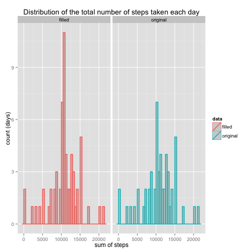
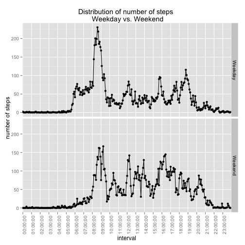

# Reproducible Research: Peer Assessment 1
This is an R-markdown for Peer Assessment 1 in Reproducible Research.  
Written by ai  

## Loading and preprocessing the data
1.Load the data  
First, go to the right directory and read in data. Then clean up the interval into more meaningful expression: time of the day. In addition, create intervalIdx variable to index interval as continuous a variable (will be useful when plotting later).

```r
setwd('~/Documents/Coursera/ReproducibleResearch//RepData_PeerAssessment1')
d = read.csv('activity.csv')
d$interval_orig = d$interval
d$interval <- strptime(paste(d$date, sapply(d$interval_orig, formatC, width = 4, flag = 0)), format = "%Y-%m-%d %H%M")
d$interval = gsub("^2012-\\w*-\\w* ","",d$interval)
d$intervalIdx = 0
for (i in 1:length(d$intervalIdx)){
  d$intervalIdx[i]= which(unique(d$interval_orig)==d$interval_orig[i])
}
```

2.Process/transform the data (if necessary) into a format suitable for your analysis
Load analysis libraries and make relevant variable numerical

```r
library(ggplot2)
library(sqldf)
dSum = sqldf('select date, sum(steps) as sumSteps from d group by date')
dSum$sumSteps = as.numeric(dSum$sumSteps)
```

## What is mean total number of steps taken per day?
_For this part of the assignment, you can ignore the missing values in the dataset._

1.Make a histogram of the total number of steps taken each day

```r
g= ggplot(dSum, aes(sumSteps)) + 
  geom_histogram(binwidth=500, colour="black", fill="white") + 
  labs(list(title = 'Distribution of the total number of steps taken each day', x = "sum of steps", y = "count (days)"))

ggsave(filename="figure/histTotalNumSteps.png",plot=g,dpi=72)
```


2.Calculate and report the mean and median total number of steps taken per day

```r
library(xtable)
table = sqldf('select avg(sumSteps), median(sumSteps) from dSum')
print(format(round(table, 2), nsmall = 2), type ='html')
```

```
##   avg(sumSteps) median(sumSteps)
## 1      10766.19         10765.00
```
Mean and median number of steps taken per day is 10766.19 and 10765.00, respectively.

## What is the average daily activity pattern?
1.Make a time series plot (i.e. type = "l") of the 5-minute interval (x-axis) and the average number of steps taken, averaged across all days (y-axis)

```r
dTimeSeries = sqldf('select interval, intervalIdx, avg(steps) as avgSteps from d group by interval')
zeroHourIdx = grep("(^\\d*):00:(\\d*)",dTimeSeries$interval) # look for xx:00:xx to use in plotting
zeroHour = dTimeSeries$interval[zeroHourIdx]

png(file='figure/avgDailyACtivityPattern.png')
plot(dTimeSeries$intervalIdx, dTimeSeries$avgSteps, type="l",ann=FALSE, xaxt="n")
axis(1, at=zeroHourIdx, labels=zeroHour)
title(main='Time-series of average steps at each interval across days',
        xlab='interval', ylab='average number of steps')
dev.off()
```


2.Which 5-minute interval, on average across all the days in the dataset, contains the maximum number of steps?

```r
maxLine = which(dTimeSeries$avgSteps==max(dTimeSeries$avgSteps))
maxSteps = dTimeSeries$interval[maxLine]
```
Interval 08:35:00 contains the max number of steps (206.1698)

## Imputing missing values
_Note that there are a number of days/intervals where there are missing values (coded as NA). The presence of missing days may introduce bias into some calculations or summaries of the data._

1.Calculate and report the total number of missing values in the dataset (i.e. the total number of rows with NAs)

```r
a=matrix(0,length(names(d)),2)
for (i in 1:length(names(d))){
  a[i,1] = names(d)[i]
  a[i,2] = sum(is.na(d[i]))
}
a = data.frame(a)
colnames(a) = c('variable','NAcount')
print(a, type="html")
```

```
##        variable NAcount
## 1         steps    2304
## 2          date       0
## 3      interval       0
## 4 interval_orig       0
## 5   intervalIdx       0
```
Out of 17568 entries in the data set, 2304 are NAs, and they are all in the steps variable.

2.Devise a strategy for filling in all of the missing values in the dataset. The strategy does not need to be sophisticated. For example, you could use the mean/median for that day, or the mean for that 5-minute interval, etc.

Considering that number os steps fluctuates during the course of the day, it's a good approach to fill the missing values using the average of steps from the same interval. In addition, as we will see later, using the mean for that day is not a plausible option, since NAs cover a whole given day.  

3.Create a new dataset that is equal to the original dataset but with the missing data filled in.

```r
dFilled = d
naEntry = which(is.na(d$steps))
for (i in 1:length(naEntry)){
  intervalIdx = which(dTimeSeries$interval==d$interval[naEntry][i])
  dFilled$steps[naEntry][i]=dTimeSeries$avgSteps[intervalIdx]
}
```

After the calculation described above, from the original data set with missing data,

```
##   steps       date interval interval_orig intervalIdx
## 1    NA 2012-10-01 00:00:00             0           1
## 2    NA 2012-10-01 00:05:00             5           2
## 3    NA 2012-10-01 00:10:00            10           3
## 4    NA 2012-10-01 00:15:00            15           4
## 5    NA 2012-10-01 00:20:00            20           5
## 6    NA 2012-10-01 00:25:00            25           6
```

the new dataset with missing values filled in was created

```
##     steps       date interval interval_orig intervalIdx
## 1 1.71698 2012-10-01 00:00:00             0           1
## 2 0.33962 2012-10-01 00:05:00             5           2
## 3 0.13208 2012-10-01 00:10:00            10           3
## 4 0.15094 2012-10-01 00:15:00            15           4
## 5 0.07547 2012-10-01 00:20:00            20           5
## 6 2.09434 2012-10-01 00:25:00            25           6
```

4.Make a histogram of the total number of steps taken each day and Calculate and report the mean and median total number of steps taken per day. Do these values differ from the estimates from the first part of the assignment? What is the impact of imputing missing data on the estimates of the total daily number of steps?


```r
dSumFilled = sqldf('select date, sum(steps) as sumSteps from dFilled group by date')
dSumFilled$sumSteps = as.numeric(dSumFilled$sumSteps)
table = sqldf('select avg(sumSteps), median(sumSteps) from dSumFilled')
print(format(round(table, 2), nsmall = 2), type="html")
```

```
##   avg(sumSteps) median(sumSteps)
## 1      10766.19         10766.19
```
Mean and median number of steps taken per day is 10766.19 and 10766.19, respectively. These numbers are slightly different from the original data set, but the difference is very small. Now I'm going to make histograms to see where the difference is coming from.


```r
dBig = data.frame(c(dSum$sumSteps, dSumFilled$sumSteps))
colnames(dBig)='dailyTotalSteps'
dBig$data = rep(c('original','filled'),each=dim(dBig)[1]/2)

g = ggplot(dBig,aes(x=dailyTotalSteps,color=data)) +
  facet_grid(.~data) + 
  geom_histogram(binwidth=500, alpha=.2, position="identity", size = .8) +
  theme_grey() + 
  labs(list(title = 'Distribution of the total number of steps taken each day', x = "sum of steps", y = "count (days)"))
ggsave(filename="figure/histOrigVsFilledData.png",plot=g, dpi=72)
```


Interestingly, the only difference between the original and the filled data is the number of days the total stop was the highest. This suggests that, in the original data set, NAs happened throughout a given day. To test this speculation, I ran;


```r
a = matrix(0,length(levels(d$date)),2)
for (i in 1:length(levels(d$date))){
  a[i,1] = levels(d$date)[i]
  a[i,2] = sum(is.na(d$steps[d$date==a[i,1]]))
}
a = data.frame(a)
colnames(a) = c('date','nNAs')
print(table(a$nNAs), type="html")
```

```
## 
##   0 288 
##  53   8
```

The table above confirms my speculation; NAs in the original dat set always happened throughout a given day, but never happened some part of a day. Number of NAs within a day is either 0 (no NAs) or 288 (all NAs).

## Are there differences in activity patterns between weekdays and weekends?
_For this part the weekdays() function may be of some help here. Use the dataset with the filled-in missing values for this part._

1.Create a new factor variable in the dataset with two levels – “weekday” and “weekend” indicating whether a given date is a weekday or weekend day.


```r
dSumFilled$days = weekdays(as.Date(dSumFilled$date), abbreviate=TRUE)
dSumFilled$days = gsub("^[m|t|w|f]\\w*", "Weekday", dSumFilled$days, perl=TRUE,ignore.case=TRUE)
dSumFilled$days = gsub("^s\\w*", "Weekend", dSumFilled$days, perl=TRUE,ignore.case=TRUE)
```

2.Make a panel plot containing a time series plot (i.e. type = "l") of the 5-minute interval (x-axis) and the average number of steps taken, averaged across all weekday days or weekend days (y-axis).

```r
dSumFilledDays = sqldf('select days, avg(sumSteps) from dSumFilled group by days')
print(dSumFilledDays, type="html")
```

```
##      days avg(sumSteps)
## 1 Weekday         10256
## 2 Weekend         12202
```
It appears that number of steps increased during the weekend compared to weekdays. I'm curious to see at which time interval the number of steps differ between weekend and weekdays. My prediction is that we see the difference in mid-day, where people usually spend time at their desks on weekdays...


```r
dFilled$days = weekdays(as.Date(dFilled$date), abbreviate=TRUE)
dFilled$days = gsub("^[m|t|w|f]\\w*", "Weekday", dFilled$days, perl=TRUE,ignore.case=TRUE)
dFilled$days = gsub("^s\\w*", "Weekend", dFilled$days, perl=TRUE,ignore.case=TRUE)

dDays = sqldf('select days, interval, intervalIdx, avg(steps) as avgSteps from dFilled group by days, interval')
zeroHourIdx = grep("(^\\d*):00:(\\d*)",dDays$interval[1:((dim(dDays)[1])/2)]) # look for xx:00:xx to use in plotting
zeroHour = dTimeSeries$interval[zeroHourIdx]

g = ggplot(data=dDays, aes(x=intervalIdx, y=avgSteps)) + 
  geom_point() + 
  geom_line() + 
  facet_grid(days~.) + 
  theme_grey() +
  scale_x_discrete(breaks = zeroHourIdx, labels = zeroHour) + 
  theme(axis.text.x = element_text(angle = 90, hjust = 1)) + 
  labs(list(title = 'Distribution of number of steps \n Weekday vs. Weekend', x = "interval", y = "number of steps"))
ggsave(filename="figure/weekdayVsWeekendSteps.png",plot=g, dpi=72)
```


As I suspected, number of steps increased during the weekend in the middle of the measured interval. Another interesting finding is that number of steps were higher on weekdays in earlier interval (I guess this person slept in on weekends and generally had a later start!).


